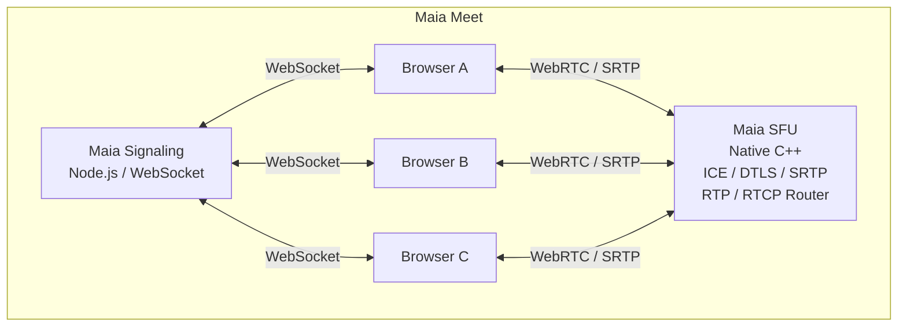
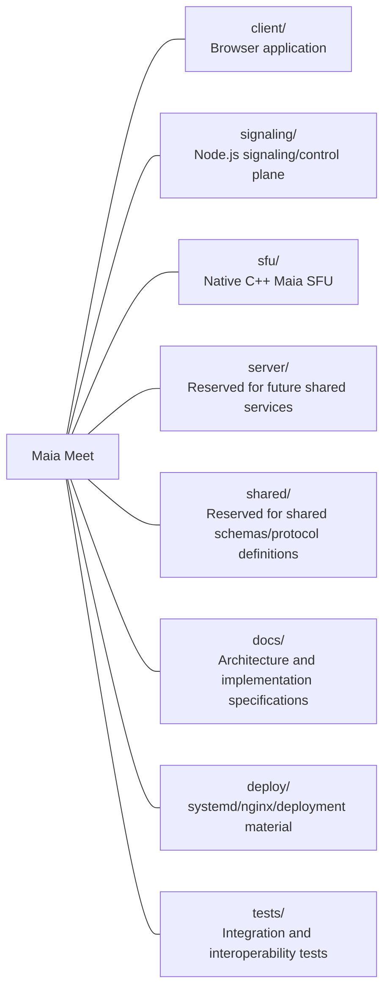

# Maia Meet

Maia Meet is an open-source, browser-first video conferencing platform built from the ground up with WebRTC.

The project intentionally does **not** depend on Jitsi Meet, Jitsi Videobridge, Jicofo, Prosody, React, or another conferencing stack. Its architecture is split into three independently evolvable components:

- **Maia Meet Client** — vanilla HTML, CSS, and JavaScript running in the browser.
- **Maia Signaling Server** — Node.js/WebSocket control plane for rooms, participants, SDP/ICE signaling, presence, and text chat.
- **Maia SFU** — native C++ Linux Selective Forwarding Unit for WebRTC media transport and RTP/RTCP routing.

## Run the application

Requires Node.js 22+. The working small-room implementation uses **WebRTC mesh**:
Node serves the browser client and signaling on one configurable TCP port.
The native SFU is an experimental component and is not used by this runtime.

```bash
make configure
make install-deps
make signaling-start
```

Open the configured URL (default `http://localhost:3081/`). For deployment,
TURN, Maia Edge and the Apps `/maia-meet/` path, see [the deployment guide](deploy/README.md).

## Project goals

1. Keep the browser client small, understandable, and framework-free.
2. Keep media local or end-to-end whenever practical; local recording is a first-class feature.
3. Separate the control plane from the media plane.
4. Build the SFU as a reusable Maia Platform infrastructure component.
5. Prefer standards and small, auditable dependencies over large conferencing frameworks.
6. Reach a useful small-conference implementation first, then add scalability features incrementally.

## Initial user experience

A user can create a meeting, share its URL, preview and select camera/microphone devices, join the room, see and hear other participants, mute/unmute, enable/disable video, share the screen, exchange text messages, and record locally.

## Target SFU architecture

The diagram below describes the intended SFU architecture. The current runtime
uses browser-to-browser WebRTC with Node.js signaling; TURN relays media when needed.



See [docs/ARCHITECTURE.md](docs/ARCHITECTURE.md) and [docs/SFU_PROTOCOL.md](docs/SFU_PROTOCOL.md).

## Initial technical scope

- Linux server target: Ubuntu 24.04 LTS
- Browser client: HTML5 + CSS + ES modules
- Signaling: Node.js + WebSocket
- SFU: C++20 native executable/service
- Transport: WebRTC over UDP, with TCP/TLS fallback considered later
- Initial audio codec: Opus
- Initial video codec: VP8
- ICE/STUN support from the beginning; TURN is a deployment requirement for Internet production
- Local recording via browser MediaRecorder
- Screen sharing via `getDisplayMedia()`

The SFU routes compressed media; it is not an MCU and should not normally decode or transcode media.

## Repository layout



## Implementation order

The first engineering milestone is intentionally narrow: **three browser clients join one room, publish one Opus audio track and one VP8 video track to Maia SFU, and receive the other participants' tracks.**

Do not begin with simulcast, server-side recording, transcription, virtual backgrounds, or large-room optimization. The roadmap adds these after the basic media path is correct.

See [ROADMAP.md](ROADMAP.md).

## Design principle

> Maia SFU should route media, not understand media.

The media payload should remain encoded whenever possible. The SFU understands transport and routing metadata (ICE, DTLS, SRTP, RTP, RTCP, SSRC, sequence numbers, timestamps, extensions, feedback) rather than decoding VP8/Opus frames.

## Documentation

- [Architecture](docs/ARCHITECTURE.md)
- [SFU protocol and media path](docs/SFU_PROTOCOL.md)
- [Signaling protocol](docs/SIGNALING_PROTOCOL.md)
- [Data model](docs/DATA_MODEL.md)
- [Security](docs/SECURITY.md)
- [Testing strategy](docs/TESTING.md)
- [Deployment](docs/DEPLOYMENT.md)
- [Development guide](docs/DEVELOPMENT.md)
- [Architecture decisions](docs/ADR.md)
- [Roadmap](ROADMAP.md)

## Status

**Pre-alpha.** Small-room mesh is implemented with configurable HTTP/WebSocket,
STUN/TURN and Apps base path. The native SFU remains experimental; its conference
media path is incomplete. Local automated browser tests exercise mesh, not the SFU.

## License

Copyright 2026 Maia Platform contributors.

Licensed under the Apache License, Version 2.0. See [LICENSE](LICENSE).
