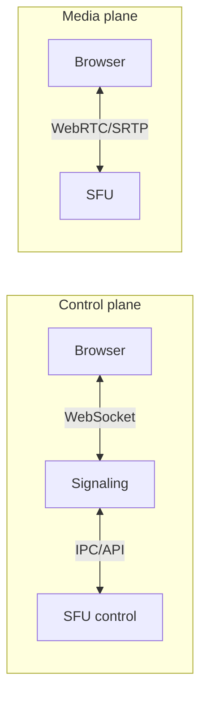
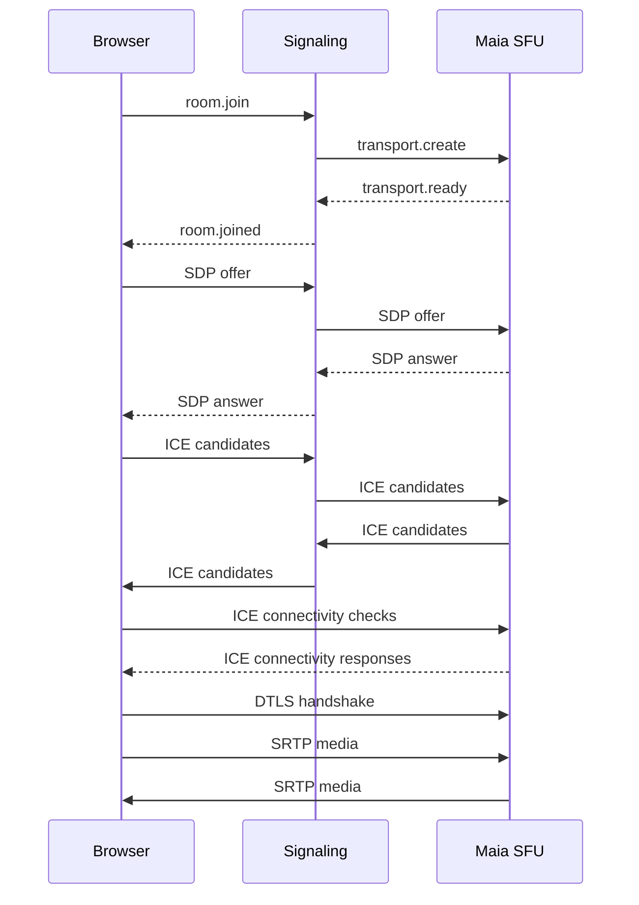
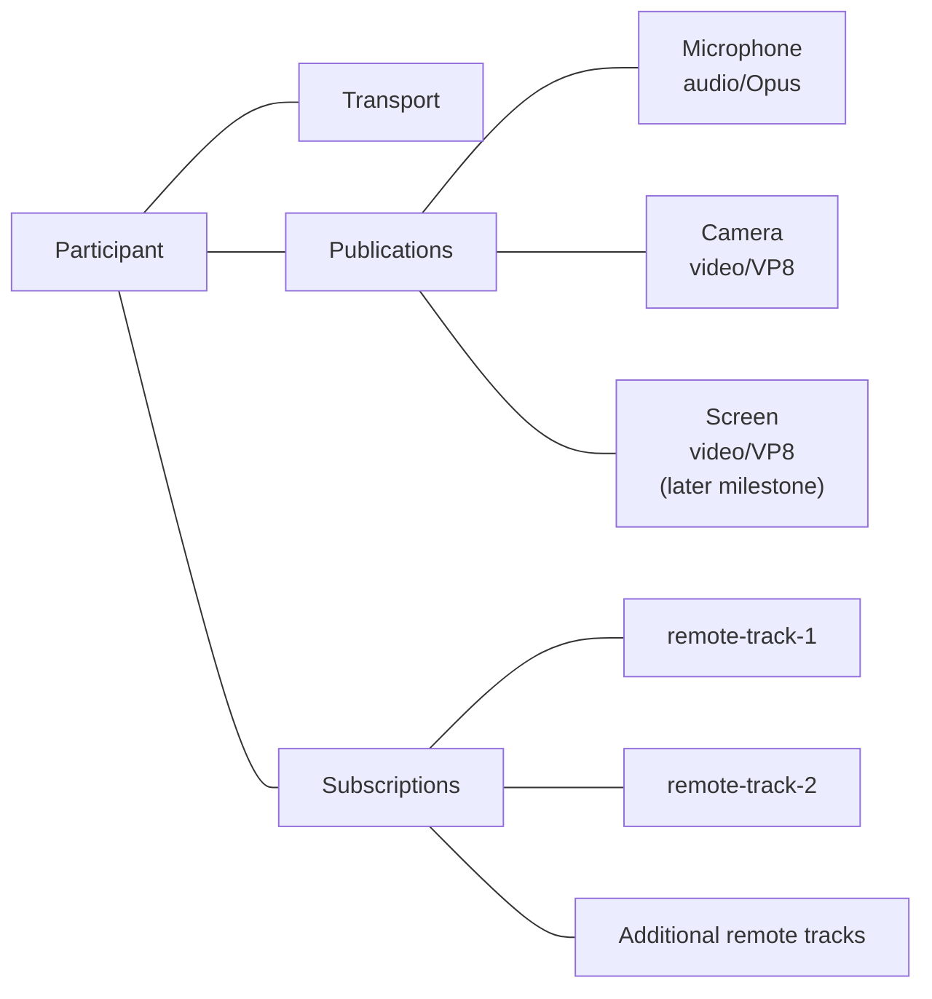
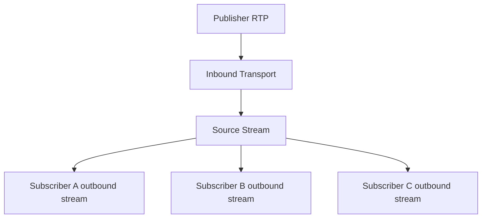
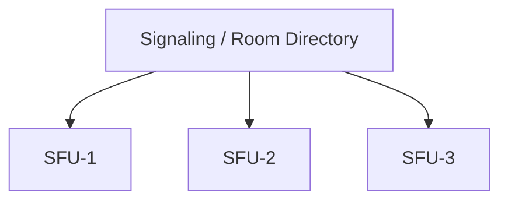

# Maia Meet Architecture

## 1. Purpose

Maia Meet is a WebRTC conferencing system with a browser client, a signaling/control service, and a native Selective Forwarding Unit (SFU). The central architectural rule is strict separation between the **control plane** and the **media plane**.

## 2. Components

### Maia Meet Client

Vanilla HTML/CSS/JavaScript. Responsibilities:

- pre-join device preview and permission handling;
- camera/microphone enumeration and selection;
- `RTCPeerConnection` lifecycle;
- SDP offer/answer and ICE candidate exchange through signaling;
- rendering remote MediaStreams;
- mute/camera controls;
- screen sharing;
- text chat;
- local recording;
- connection statistics through `getStats()`;
- UI layout and participant state.

The client does not implement RTP, DTLS, SRTP, codecs, or ICE itself; those are provided by the browser WebRTC implementation.

### Maia Signaling Server

Node.js control plane. Responsibilities:

- room creation and lookup;
- participant identity within a room;
- WebSocket sessions;
- signaling message validation/routing;
- presence and chat;
- coordination with Maia SFU;
- authentication/authorization hooks;
- rate limiting and observability.

It must never become a media relay.

### Maia SFU

Native C++20 Linux service. Responsibilities:

- WebRTC transport termination;
- ICE connectivity;
- DTLS handshake and SRTP key establishment;
- SRTP/SRTCP protection/unprotection;
- RTP/RTCP parsing;
- publisher track registration;
- subscriber routing;
- RTP stream rewriting where required;
- RTCP feedback forwarding/translation;
- retransmission support and packet cache;
- later: simulcast layer selection and congestion-aware forwarding.

The SFU should avoid media decode/transcode in the normal path.

## 3. Control plane vs media plane

A failure or restart of the signaling process should be designed not to corrupt SFU media state. Later versions may support signaling reconnection without immediately terminating media.

## 4. Browser-to-SFU connection lifecycle

The exact ownership of SDP generation may evolve. The invariant is that the browser uses standard WebRTC while the SFU exposes a standards-compatible WebRTC endpoint.

## 5. Media model

Each participant has one WebRTC transport initially. A participant may publish multiple tracks:

A future implementation may split send and receive transports, but v0.x favors fewer moving parts.

## 6. Routing model

For every published track the SFU maintains a source stream and zero or more subscriber streams.

Outbound streams may require rewritten SSRC, sequence number and timestamp state. RTCP feedback must be mapped back to the appropriate source.

## 7. Concurrency model

Start simple. Recommended v0.1 design:

- one event-driven UDP/network loop;
- explicit per-transport state machines;
- bounded packet buffers;
- a small worker pool only for tasks that must not block network I/O;
- immutable or single-owner conference/transport state wherever possible.

Avoid a thread-per-participant design.

## 8. Dependencies

Do not implement cryptographic primitives. Candidate dependency categories:

- TLS/DTLS: OpenSSL;
- SRTP/SRTCP: libsrtp;
- ICE/STUN/TURN client behavior: evaluate libnice, libjuice, or a small standards-focused implementation before committing;
- JSON/control protocol: small C++ JSON library if needed;
- logging: lightweight library or project-owned logger.

Dependency selection is an implementation milestone and must be recorded as an ADR.

## 9. Codec policy

v0.1 interoperable baseline:

- audio: Opus;
- video: VP8.

Later candidates: H.264 and AV1. The SFU should not hard-code payload type numbers; mappings come from SDP negotiation.

## 10. Scaling boundaries

A single SFU process is the first target. Horizontal scale comes later:

Room affinity keeps all participants in a room on one SFU initially. Cascaded/federated SFUs are explicitly out of scope until single-node behavior is mature.

## 11. Non-goals for v0.1

- MCU composition/transcoding;
- server-side recording;
- SIP/PSTN;
- federation;
- E2EE beyond standard hop encryption;
- large webinars;
- AI transcription/summarization;
- mobile native applications.
