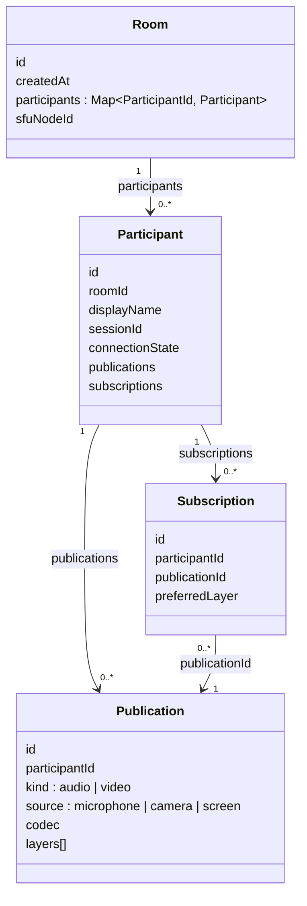
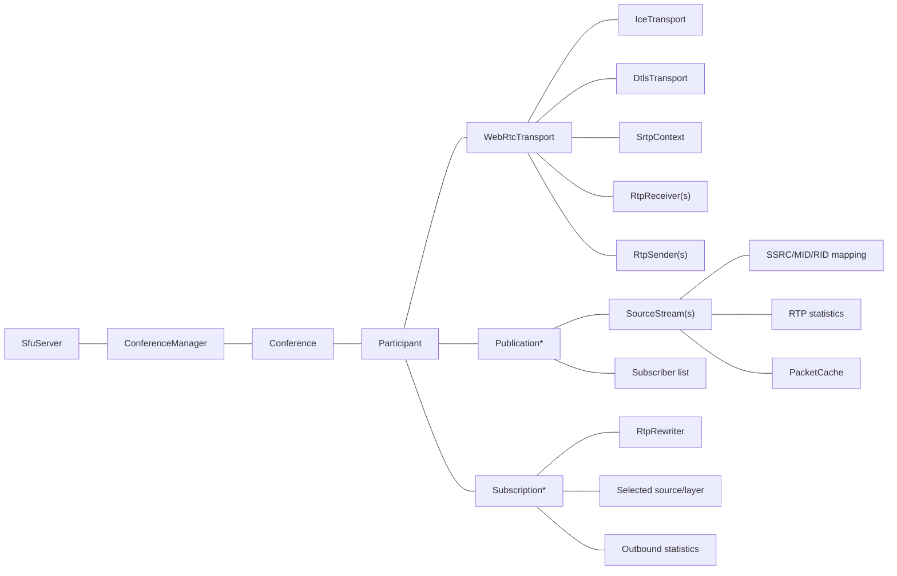

# Core Data Model

## Control plane

## SFU media plane

Suggested C++ ownership model:

Use stable opaque IDs at component boundaries. Do not expose C++ pointers or process-local numeric indexes in the signaling protocol.
