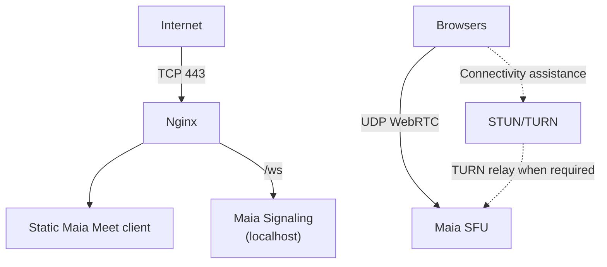

# Deployment Architecture

> Current runtime: small-room WebRTC mesh. See [running and testing Meet](../deploy/README.md)
> and [ADR 0010](adr/0010-small-room-mesh-runtime.md). The SFU sections below describe
> the target architecture and acceptance criteria, not completed functionality.

## Single-node development/initial production

The SFU media port range is configured explicitly and opened in the firewall. TURN should be deployed for real Internet use because some clients cannot establish a usable direct UDP path to the SFU.

## Services

- `maia-meet-signaling.service`
- `maia-sfu.service`
- Nginx TLS reverse proxy/static server
- TURN server when moving beyond controlled testing

## Observability

At minimum expose/log:

- active rooms;
- active participants/transports;
- ICE/DTLS connection failures;
- inbound/outbound packets and bytes;
- packet loss/jitter/RTT where available;
- PLI/NACK counts;
- process CPU/RSS;
- UDP send/receive errors.

Metrics must avoid participant media content and unnecessary personally identifying data.
