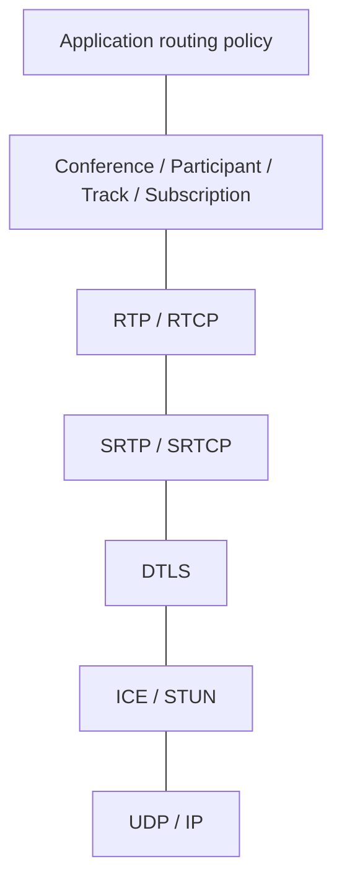
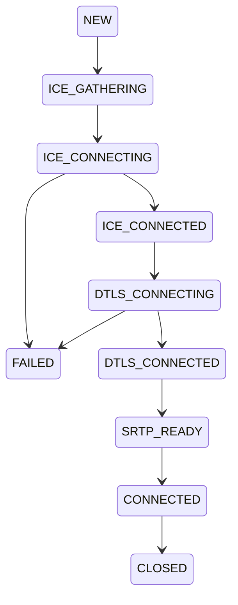
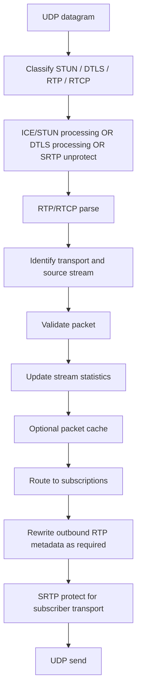
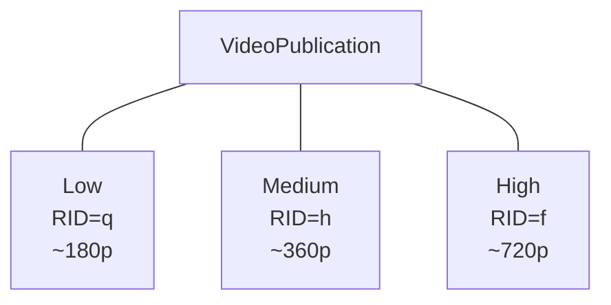

# Maia SFU Protocol and Media Path

## 1. Scope

This document specifies the implementation model for Maia SFU. It is not a replacement for the IETF/W3C specifications; standards remain authoritative.

## 2. Layer stack

TURN is a relay mechanism used when direct connectivity to the SFU cannot be established; it does not replace ICE.

## 3. Transport state machine

Every transition must be observable and have a timeout/error path.

## 4. Inbound packet path

The implementation must use bounded memory and reject malformed packets early.

## 5. RTP source identity

Do not assume SSRC is globally unique. Resolve streams in the context of a transport/session and negotiated track metadata. Maintain explicit mappings between negotiated MID/RID, SSRC and internal TrackId where available.

## 6. Sequence/timestamp rewriting

A subscriber can change layers, pause/resume, or join after a source has started. The outbound stream therefore needs its own sequence-number continuity state. Timestamp continuity must also be preserved when switching sources/layers.

Implement this behind an `RtpRewriter` abstraction rather than scattering arithmetic through the router.

## 7. RTCP

Milestone order:

1. Parse Sender Report / Receiver Report.
2. Track packet loss, jitter and RTT-related data.
3. Support Picture Loss Indication (PLI).
4. Support Generic NACK and retransmission cache.
5. Add transport-wide congestion control/feedback as the architecture matures.

Feedback received from subscribers must be associated with the relevant publication and translated/aggregated where required.

## 8. Keyframes

When a subscriber begins receiving a video source or changes simulcast layer, request a keyframe using RTCP PLI when appropriate. Rate-limit keyframe requests to prevent feedback storms.

## 9. Simulcast (post-v0.1)

A publisher may provide multiple encodings identified by RID/SSRC. Model them as layers of one logical publication:

The subscriber chooses a desired layer; the SFU chooses an actually available layer based on policy and bandwidth information.

## 10. Packet cache

For NACK retransmission maintain a bounded rolling cache per source stream. Index by RTP sequence number with wraparound-safe logic. Never allow unbounded packet retention.

## 11. Media encryption boundary

Standard WebRTC transport encryption terminates at the SFU because the SFU must inspect RTP headers and route/rewrite packets. Application-level end-to-end media encryption can be investigated later using browser-supported encoded transforms; it is not a v0.1 requirement.

## 12. First interoperability target

Success for the first media milestone means:

- Chrome/Chromium browser establishes ICE + DTLS + SRTP with Maia SFU;
- browser publishes one Opus track and one VP8 track;
- SFU parses RTP without decoding payloads;
- a second browser receives forwarded media;
- a third browser joins and all three can exchange media through the SFU;
- basic RTCP statistics are visible in logs/tests.
